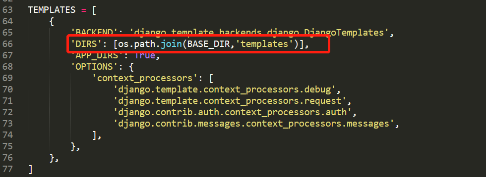

# Django添加富文本编辑器

**徐静 算法工程师**

## 0.环境

```shell
python3.6.X
win10


django>=2
django-crispy-forms>=1.6.0
django-import-export>=0.5.1
django-reversion>=2.0.0
django-formtools==2.1
future==0.15.2
httplib2==0.9.2
six==1.10.0

```

本教程假设您多Django熟悉！

需要的资源

+ [xadmin](https://github.com/sshwsfc/xadmin/tree/django2)
```shell
git clone https://github.com/sshwsfc/xadmin/tree/django2
```
+ [DjangoUeditor](https://github.com/twz915/DjangoUeditor3/)
```shell
git clone https://github.com/twz915/DjangoUeditor3.git
```

## 1.xadmin

1.解压并拷贝到`extra_apps`

2.修改settings文件:





3.在urls添加xadmin:


4.修改xadmin

```python
# adminx.py

class GlobalSettings:
    """
    后台修改
    """
    site_title = '修改后的名称'
    site_footer = '修改后的底部'
    menu_style = 'accordion'  # 开启分组折叠

xadmin.site.register(views.CommAdminView, GlobalSettings)
```

或者

`xadmin/views/base.py`


5.添加主题

`blog_list/adminx.py`


## 2.DjangoUeditor

1.加压到extra_apps

2.修改urls.py 和 models.py


3.添加adminx.py和修改admin.py


4.修改apps.py


最后 `python manage.py runserver ip:port`后会报如下错误


找到虚拟环境中包的位置，然后注释调改行代码就可以解决！

## 在前端显示富文本及其内容

**1.在前端展示富文本编辑器**


**2.展示富文本的内容**

```html
<!-- 法1 -->
<!-- {{ article_content | safe }} -->

<!-- 法2 -->

<!-- 
{{blog.content }}
 -->

```
